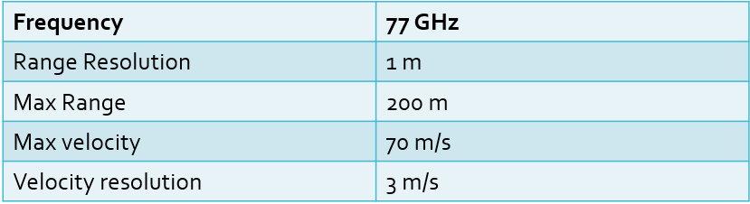
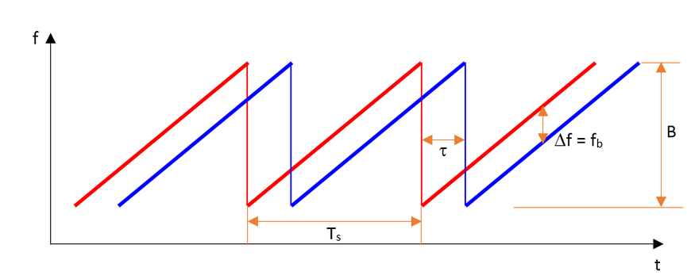
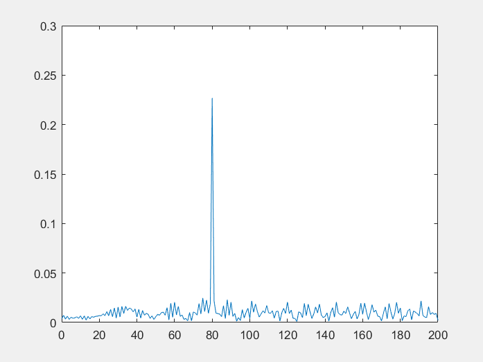
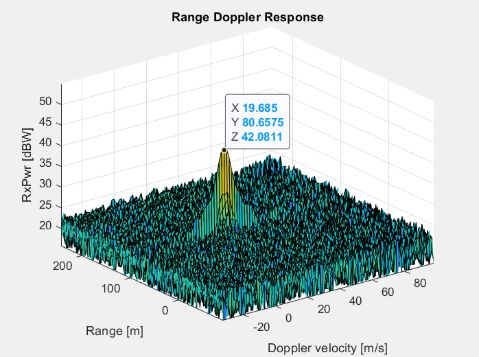
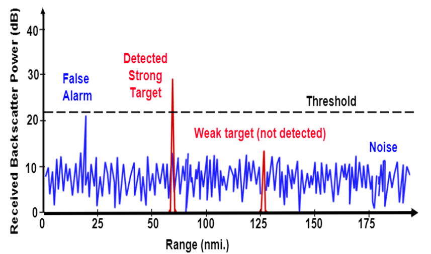
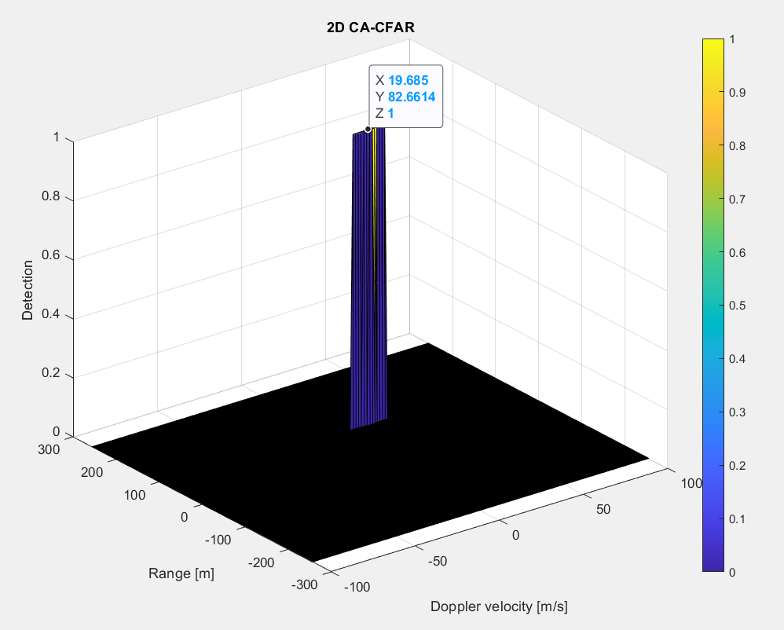

# SFND Radar Target Generation and Detection

## Project Overview

<p align="center">

</p>
<p align="center">
Project Layout
</p>

<p align="center">

</p>
<p align="center">
Radar System Requirements
</p>

The goal of the Project is:
* Configure the FMCW waveform base on the system requirements.
* Define the range and the velocity of the target and simulate its displacement.
* For the same simulation loop process the transmit and receive signal to determine the beat signal.
* Perform Range FFT on the received signal to determine the Range.
* On the end, perform the CFAR processing on the output of the 2nd FFT to display the target.


### FMCW Waveform Design

A Frequency Modulated Continuos Wave is a signal whose frequency linearly increases and decreases over time. They are also referred to as upramps and downramps. The two most common waveform pattern used for FMCW radars are sawtooth and triangular. The sawtooth waveform generally uses just the upramps, whereas the triangular waveform uses both upramps and downramps. In this example FMCW signal is a saw-tooth signal:

<p align="center">

</p>
<p align="center">
FMCW Waveform
</p>
```matlab
    %% FMCW Waveform Generation

    % *%TODO* :
    % Design the FMCW waveform by giving the specs of each of its parameters.
    % Calculate the Bandwidth (B), Chirp Time (Tchirp) and Slope (slope) of the FMCW
    % chirp using the requirements above.
    B = c / 2* ds;
    Tchirp = 5.5 * (range_max*2/c);
    slope = B / Tchirp;
    disp(slope);

    %Operating carrier frequency of Radar 
    fc= 77e9;             %carrier freq
                                                          
    %The number of chirps in one sequence. Its ideal to have 2^ value for the ease of running the FFT for Doppler Estimation. 
    Nd=128;                   % #of doppler cells OR #of sent periods % number of chirps

    %The number of samples on each chirp. 
    Nr=1024;                  %for length of time OR # of range cells

    % Timestamp for running the displacement scenario for every sample on each
    % chirp
    t=linspace(0,Nd*Tchirp,Nr*Nd); %total time for samples

    % Creating the vectors for Tx, Rx and Mix based on the total samples input.
    Tx=zeros(1,length(t)); %transmitted signal
    Rx=zeros(1,length(t)); %received signal
    Mix = zeros(1,length(t)); %beat signal

    % Similar vectors for range_covered and time delay.
    r_t=zeros(1,length(t));
    td=zeros(1,length(t));
```
### Signal Generation and Moving Target Simulation
Theory behind the signal generation and moving target simulation consists of idea that:
1. Transimitted signal will be a cosine function
2. Signal will bounce of the target and be received by the radar as a time delayed cosine function.
3. Transmitted and Received signal is mixed to create the beat signal with the frequency shift

<p align="center">

</p>
<p align="center">
Signal Propagation
</p>

```matlab
%% Signal generation and Moving Target simulation
% Running the radar scenario over the time. 

for i=1:length(t)         
        
    % *%TODO* :
    % For each time stamp update the Range of the Target for constant velocity. 
    r_t(i) = target_position + t(i) * velocity;
    td(i) = 2 * r_t(i) / c;

    % *%TODO* :
    % For each time sample we need update the transmitted and
    % received signal. 
    Tx(i) = cos(2 * pi * (fc * t(i) + 0.5 * slope * t(i)^2));
    Rx(i) = cos(2 * pi * (fc * (t(i) - td(i)) + 0.5 * slope * (t(i) - td(i))^2));
  
    % *%TODO* :
    % Now by mixing the Transmit and Receive generate the beat signal
    % This is done by element wise matrix multiplication of Transmit and
    % Receiver Signal
    Mix(i) = Tx(i) .* Rx(i);
    
end
```

### Range Measurement 

Range is measured and displayed by plotting the Fourier Transformation of the beat signal against range.

For the length of the signal we take the length of 1 saw in the positive direction as that will contain all the needed infromation.
```matlab
    %% RANGE MEASUREMENT

    % *%TODO* :
    % reshape the vector into Nr*Nd array. Nr and Nd here would also define the size of
    % Range and Doppler FFT respectively.
    Mix = reshape(Mix, [Nr, Nd]);

    % *%TODO* :
    %run the FFT on the beat signal along the range bins dimension (Nr) and
    %normalize.
    % TODO : Compute the Fourier transform of the signal. 
    signal_fft = fft(Mix);

    % *%TODO* :
    % Take the absolute value of FFT output
    L = Tchirp * B;
    signal_fft = abs(signal_fft/L);

    % *%TODO* :
    % Output of FFT is double sided signal, but we are interested in only one side of the spectrum.
    signal_fft = signal_fft(1:L/2+1);

    % plotting the range
    f = B * (0:(L/2))/L;
    R = (c * Tchirp * f) / (2 * B);
    figure ('Name','Range from First FFT')
    plot(R, signal_fft);
    axis ([0 200 0 0.3]);

    % TODO* :
    % plot FFT output 
    figure ('Name','FFT')
    plot(f, signal_fft);
```

The position of the target can be seen as a spike on the plot on 80m distance, which is exactly the distance we used when simulating the target.
<p align="center">

</p>
<p align="center">
Target distance
</p>

### Range Doppler Response

Once the range bins are determined by running range FFT across all the chirps, a second FFT is implemented along the second dimension to determine the doppler frequency shift. As discussed, the doppler is estimated by processing the rate of change of phase across multiple chirps. Hence, the doppler FFT is implemented after all the chirps in the segment are sent and range FFTs are run on them.

The output of the first FFT gives the beat frequency, amplitude, and phase for each target. This phase varies as we move from one chirp to another (one bin to another on each row) due to the target’s small displacements. Once the second FFT is implemented it determines the rate of change of phase, which is nothing but the doppler frequency shift

```matlab
    %% RANGE DOPPLER RESPONSE

    % Range Doppler Map Generation.

    % The output of the 2D FFT is an image that has reponse in the range and
    % doppler FFT bins. So, it is important to convert the axis from bin sizes
    % to range and doppler based on their Max values.
    Mix=reshape(Mix,[Nr,Nd]);

    % 2D FFT using the FFT size for both dimensions.
    sig_fft2 = fft2(Mix,Nr,Nd);

    % Taking just one side of signal from Range dimension.
    sig_fft2 = sig_fft2(1:Nr/2,1:Nd);
    sig_fft2 = fftshift (sig_fft2);
    RDM = abs(sig_fft2);
    RDM = 10*log10(RDM) ;

    % Use the surf function to plot the output of 2DFFT and to show axis in both
    % dimensions
    doppler_axis = linspace(-100,100,Nd);
    range_axis = linspace(-200,200,Nr/2)*((Nr/2)/400);
    figure,surf(doppler_axis,range_axis,RDM);
    title('Range Doppler Response')
    xlabel('Doppler velocity [m/s]')
    ylabel('Range [m]')
    zlabel('RxPwr [dBW]')
```

<p align="center">

</p>
<p align="center">
Range Doppler Map
</p>


## 2D CFAR

Clutter (noise in the signal) thresholding is important to filter out clutter for successful detection of targets. This is critical in a driving scenario to avoid the car from suddenly braking in the absence of valid targets. This sudden braking happens when the radar detects reflections that are generated from the clutter. Techniques to treshold the clutter can be divided into fixed and dynamic. Fixed techniques are the simplest but they can lead to false alarms and missed detections.

<p align="center">

</p>
<p align="center">
Fixed Clutter Tresholding
</p>

CFAR (Constant False Alarm Rate) is a technique of dynamic clutter thresholding, With CFAR the noise at every or group of range/doppler bins is monitored and the signal is compared to the local noise level. This comparison is used create a threshold which holds the false alarm rate constant.

CA-CFAR is the most commonly used CFAR detection technique. The FFT blocks are generated on implementing range and doppler FFTs across the number of chirps. The CFAR process includes the sliding of a window across the cells in FFT blocks. Each window consists of the following cells.
* Cell Under Test : The cell that is tested to detect the presence of the target by comparing the signal level against the noise estimate (threshold).
* Training Cells : The level of noise is measured over the Training Cells. 
* Guard Cells : The cells just next to CUT are assigned as Guard Cells. The purpose of the Guard Cells is to avoid the target signal from leaking into the training cells.
* Threshold Factor (Offset) : Use an offset value to scale the noise threshold. If the signal strength is defined in logarithmic form then add this offset value to the average noise estimate, else multiply it.

<p align="center">

</p>
<p align="center">
1D CA-CFAR Cells
</p>

<p align="center">

</p>
<p align="center">
1D CA-CFAR Detections
</p>

The 2D CFAR is similar to 1D CFAR, but is implemented in both dimensions of the range doppler block. The 2D CA-CFAR implementation involves the training cells occupying the cells surrounding the cell under test with a guard grid in between to prevent the impact of a target signal on the noise estimate.
<p align="center">

</p>
<p align="center">
2D CA-CFAR Cells
</p>

In the Project 2D CFAR implementation steps consist of:
1. Chosing the numbers of training and guard cells as well as the offset value.
2. Calculating the total number of training cells that will be taken into consideration
3. Looping across all the cells of the Range Doppler Response matrix in range dimension for every cell in the doppler dimension and for every iteration calculating
3.1 Signal level for all the training cells.
3.2 Treshold is calculated by dividing the signal level with the total number of training cells to be taken into consideration and the adding offset to it to prevent false alarms.
3.3 When we have the treshold we determine the signal level of Cell-Under-Test (CUT).
3.3 If the CUT signal is above the treshold level is set to 1 and all signal that falls below the treshold level is set to 0.

The numbers of training and guard cells as well as offset value were chosen experimentally as ones providing the best results for the use case:
```matlab
% The number of Training Cells in both the dimensions.
Tr = 14; % Training cells in Range dimension
Td = 8; % Training cells in Doppler dimension

% The number of Guard Cells in both dimensions around the Cell under 
% test (CUT) for accurate estimation
Gr = 8; % Guard cells in Range dimension
Gd = 4; % Guard cells in Doppler dimension

% The offset the threshold by SNR value in dB
offset = 7;
```
After setting the cells and offset parameters CFAR is calculated by looping over the cells:

```matlab
for i = 1:(Nr/2 - (2*Gr + 2*Tr))  % looping across cells  in range dimension (X)
    for j = 1:(Nd - (2*Gd + 2*Td)) % for each cell in range dimension looping across cells in doppler dimension (Y)

        % For every iteration sum the signal level within all the training
        % cells. To sum convert the value from logarithmic to linear using 
        % db2pow function.
        signal_1 = sum(db2pow(RDM(i : i + 2*Tr + 2*Gr, j : j + 2*Td + 2*Gd)), "all");
        signal_2 = sum(db2pow(RDM(i + Tr : i + Tr + 2*Gr, j + Td : j + Td + 2*Gd)), "all");
        signal_level = signal_1 - signal_2;

        % Average the summed values for all of the training cells used. 
        % After averaging convert it back to logarithmic using pow2db. 
        % Measure and average the noise across all the training cells. This
        % gives the threshold. Add the offset (if in signal strength in dB)
        % to the threshold to keep the false alarm to the minimum
        threshold = signal_level / num_cells;
        threshold = pow2db(threshold) + offset;
        threshold = db2pow(threshold);

        % Determine the signal level at the Cell Under Test.
        signal = db2pow(RDM(i + Tr + Gr, j + Td + Gd));

        % If the CUT signal level is greater than the Threshold, assign a 
        % value of 1, else equate it to zero.
        if(signal <= threshold)
            signal = 0;
        else
            signal = 1;
        end
     
        signal_cfar_2D(i + Tr + Gr, j + Td + Gd) = signal;
    end
end
```
This produces 2D CFAR figure showing range and speed of detected target.

<p align="center">

</p>
<p align="center">
2D CA-CFAR 
</p>

